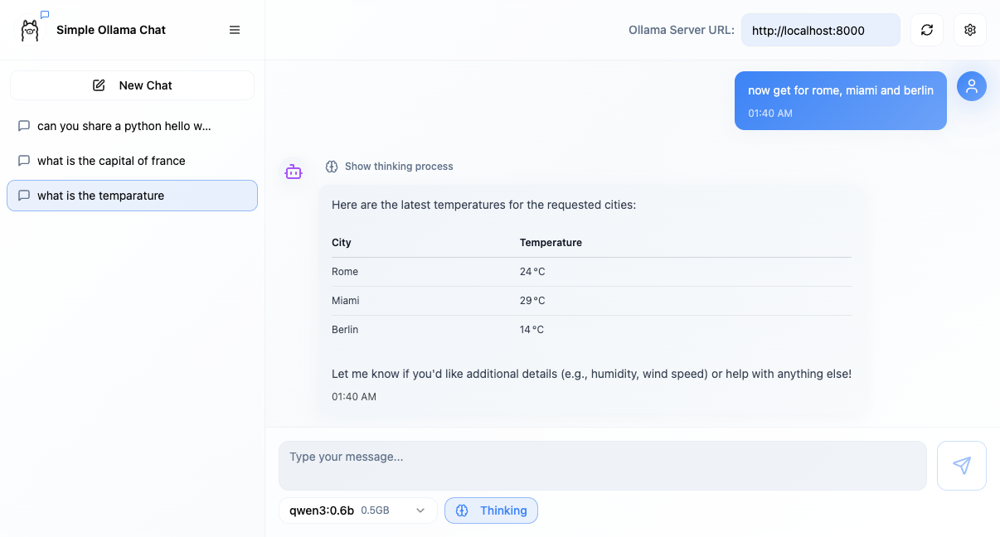
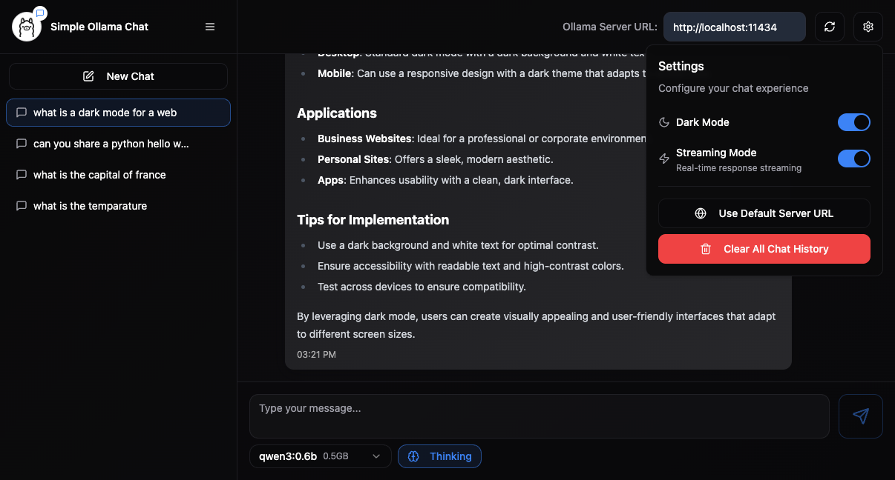

# Simple Ollama Chat

A lightweight, privacy-focused chat client for Ollama models, built with React and TypeScript. Use it to quickly experiment with different Ollama endpoints and models in a clean, responsive UI.




## Features

- 💬 Chat with Ollama models using a clean, intuitive interface.
- 🔌 Connect to any Ollama API endpoint.
- 🔁 Switch models on the fly.
- 🧠 Toggle "thinking" mode for models that support it.
- ⚡ Streaming responses for a more dynamic, real-time experience.
- 🌗 Light and dark theme support.
- 🔒 Privacy-first, chat history is stored locally in the browser's `localStorage`.

## Requirements

- Node.js (recommended via `nvm`) and `npm` or `pnpm`.

## Quick Start

Run these commands to get started locally:

```sh
# Clone the repository
git clone https://github.com/jonigl/simple-ollama-chat.git
cd simple-ollama-chat

# Install dependencies
npm install

# Start the dev server
npm run dev
```

Open `http://localhost:5173` (or the URL shown by Vite) in your browser.

## Usage

- Select an Ollama model from the UI or enter a custom API endpoint.
- Send messages and receive streaming responses when supported by the model.
- Switch themes or toggle thinking mode via the settings panel.

This project was scaffolded using Lovable.

## Privacy and Storage

All chat history is saved locally to the browser's `localStorage` by default. No data is sent to any third-party storage unless you explicitly configure a remote endpoint.


## MCP Server Bridge

To effortlessly integrate and test Model Context Protocol (MCP) servers with this client, you can use the ollama-mcp-bridge: https://github.com/jonigl/ollama-mcp-bridge. The bridge acts as a transparent proxy in front of the standard Ollama API, enabling the seamless use of custom MCP servers alongside existing Ollama models. It introduces a dedicated endpoint that you can point this client toward, significantly simplifying development and testing of your MCP servers, whether they run locally or are accessed behind a network proxy.

You can point this client's Ollama endpoint directly at the bridge (for example, http://localhost:PORT). This configuration allows your client, the bridge, Ollama, and your MCP server to all run and interact locally. This creates a streamlined environment for end-to-end testing and development of your custom MCP server logic.

## Tech Stack and knowledgements

- Vite
- React + TypeScript
- Tailwind CSS
- shadcn/ui components
- Lovable was used to create the initial project scaffolding.
